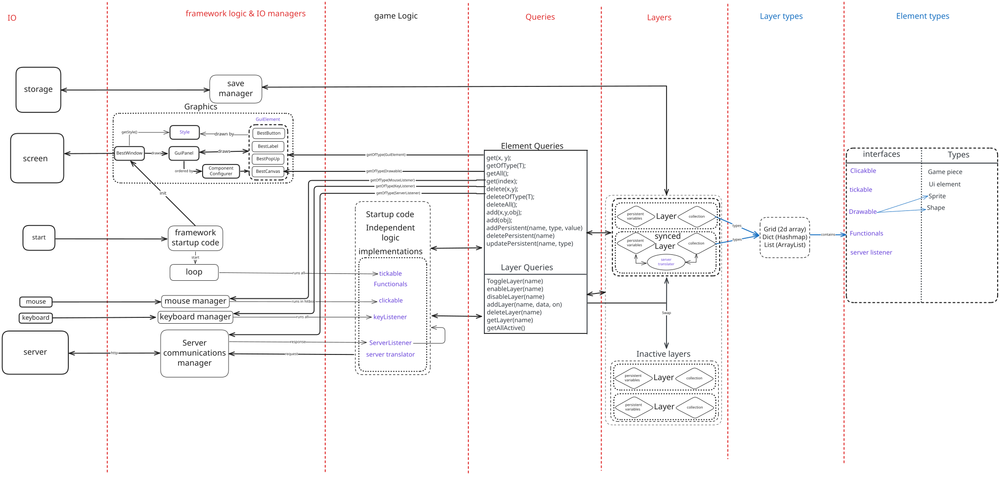

# BestBoard framework
The best framework (hell yeah) (tevreden RUBEN?) (Ja hoor, ziet er geweldig uit!)

# Documentation

# Layers
The core of the framework works via simple chart

According to this flowchart. 
The framework is centered around layers, and the LayerManager that contains it.
All states that the framework holds are stored in these layers,
and every layer only holds one type (but multiple childTypes), in a group.  
Layer is abstract and thus allows for multiple implementations,
All layers come with persistent variables,
which is a String to Object mapping for custom use, with a couple that are used by the framework itself. 

The layer also comes with predefined getters, setters, and deleters for the Implementation to use when relevant.
## Methods:
| Name                        | Returns  | Explanation                                                                                                  |
|-----------------------------|:--------:|:-------------------------------------------------------------------------------------------------------------|
| isActive()                  | boolean  | returns if ACTIVE_KEY is set                                                                                 |
| setActive(boolean)          |   void   | sets the ACTIVE_KEY                                                                                          |
| get(...)                    |    T     | returns the element at the given index.   There are multiple index choices based on layer type           |
| getOfType(Class)            | List\<T> | returns all elements that are instances of the given class                                                   |
| getAll()                    | List\<T> | returns all elements, without indexes                                                                        |
| delete(...)                 |   void   | deletes the element at the given index.   There are multiple index choices based on layer type           |
| delete(T)                   |   void   | deletes the element, at an unknown index                                                                     |
| deleteOfType(Class)         |   void   | deletes all elements that are an instance of the given class                                                 |
| deleteAll()                 |   void   | clears all elements from the layer                                                                           |
| add(..., T)                 |   void   | adds an element at a given index.   There are multiple index choices based on layer type                 |
| add(T)                      |   void   | adds an element, at the end, if indexed. adds regularly if not indexed.                                      |
| getPersistent<U>(String)    |    U     | gets the persistent value at the given String mapping, or null if missing.   Auto casted for convenience |
| addPersistent<V>(String, V) |   self   | adds a value at the given String mapping.   Generic typed for convenience. returns self for chaining     |
| deletePersistent(String)    |   void   | removes a value at the given String mapping                                                                  |

## LayerManager
The layer manager stores all layers, in most cases there should only be 1 LayerManager.
The LayerManager is a wrapper of a HashMap with getters and setters to change its values

## Layer types
### HashMapLayer 
A layer that wraps a HashMap<String, T>.  
supports: getOfType(Class), getAll(), get(String), getLayerType(), delete(T), deleteAll(), add(String, T)

### ListLayer
A layer that wraps an ArrayList<T>.  
supports: getOfType(Class), getAll(), get(int), getLayerType(), delete(T), delete(int), deleteAll(), add(T)

### MatrixLayer
A layer that wraps a 2d array. 
supports get(int, int), getOfType(Class), getAll(), getLayerType(), delete(T), deleteAll(), add(int, int, T)
also has 

### SyncedLayer
**W.I.P**

# Main loop
The main loop is responsible for running all code that needs to be executed each tick. 
It is constructed with the following constructor:

    public MainLoop(int targetTps, LayerManager layerManager, ServerManager serverManager)
in which the targetTps is the amount if times the loop runs each second,
layerManager is the backing layerManager, and serverManager sends the server events. 
To start the loop just call:
    
    public void loop()
! No code can run after the loop() call until the loop is closed. 
The loop calls the following things each tick, in this order:

* Tickable.tick(), for every Tickable in the backed LayerManager
* ServerListener.message(String), in every ServerListener in the backed LayerManager,
  for every response the server sent since the last check.
* Clickable.click(), for every time the mouse has been clicked, 
while inside the hitbox of the given clickable inside the given clickable inside LayerManager
* Canvas.refresh(), if a canvas is known to the BestWindow

# Graphics
The graphics are deeply entrenched in the Layer system. 
With every gui element and Drawable being elements in layers

## Gui elements

### BestWindow
BestWindow is a wrapper of JFrame, but is also responsible for the drawing of the gui elements on the screen. 
BestWindow is a singleton, so only one window can exist at the same time, but it is also easily obtainable via 

    BestWindow.get()    
    
To create a new window call

    BestWindow.create(layerManager: LayerManager, title: String)

Where layerManager contains (or will contain) all gui elements and title is the title of the JFrame
When gui changes are made to the gui, the window can be updated via bestWindow.update().  

Which causes the frame to Automatically reflect all JComponent, BestGuiElement and GuiRepresentable.  

To change the order at which layers are drawn,
set the persistentVariable RENDER_PRIORITY_KEY to a negative int to priority it. 

To make modifications to the Container on which is drawn, or change the Container entirely, 
you can use the persistentVariable FRAME_PREPARER_KEY, of type Function<JComponent, JComponent>.
If multiple FRAME_PREPARERS are specified, only the one in the layer with the highest priority is used.

#### Component configurers
If, for instance, the panel you use is of type splitPane, you can't just use pane.add(component).  
To Account for this ComponentConfigurers which is responsible for adding the give component to the given container.  
ComponentConfigurers can be configured in a BesGuiElement, with the setComponentConfigurer method. 
Or with the DEFAULT_CONFIGURER_KEY for a layer,
which enables it as default for every element in the layer. 
Example:
    
    BestButton b = new BestButton(...).setConfigurer((parent, child) -> {
        parent.add(child);
    });

### BestButton
A button with a custom [style](#style), [font size, font type](#Font), and onClick Runnable.  

### BestLabel
A label with a custom [style](#style), [font size and font type](#Font).  

### BestPopUp
A popup, used for things like confirmation boxes.
It Has its own LayerManager elements drawn on this popUp.
Look at TicTacToeGuiLayer for an example.

### BestCanvas
The element responsible for drawing all drawables.
Draws all drawables inside the passed in LayerManager, every time refresh is called
Has a fixed width and height.
All drawables are drawn relative to this element.
Only one BestCanvas can exist at a time, having a second one in your layers results in a crash.

## Style
Style is an interface responsible for the visuals of the framework. 
This includes drawing panels, drawing text, background color, choosing fonts and drawing buttons. 
To create a new Style, simply implement Style and fill in the blanks

#### Font
Some styles need different sizes of fonts than other styles. 
To help abstract this from the GuiElements and users, size is instead specified in Sizes: large, medium and small.

# Entry points
In the framework, all game specific code should be in the game logic section